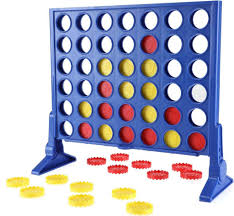

# CLI GAMES

A collection of games to play on the command line interface, built with vanilla Javascript and Node.

## Getting Started

Make sure to clone the repository, and then run `npm install`, `npm init`, this should get the necessary dependencies started.
## Connect 4

Basic implementation of Connect 4 using the command line interface. Users can play with either 2 human players, 1 human player and one computer player (bot), or watch two bots play eachother.

### User Guide

Initiate a game by creating a `Game` object. This is passed two players, (defaulted to two bots) a number of rows and columns (defaulted to the standard 6 x 7 game board), and a strip size (think connect 7 etc, but defaulted to 4).

To create players, use `player = new HumanPlayer(name)`, or `bot = new ComputerPlayer()`.

To run the game once you have create a game object, use `game.play()`, where game is the previously created `Game` object.

Run with `node c4.js`

## Rock, Paper, Scissors

Basic implementation of rock, paper, scissors using the command line interface. Users can play a computer bot. Pair programming exercise with Ria Patterson.

### User Guide

Simply run with `node rps.js`

Enjoy!!!

